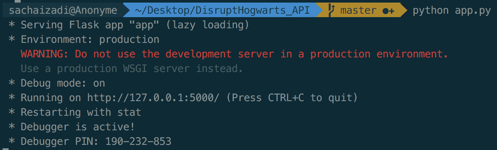
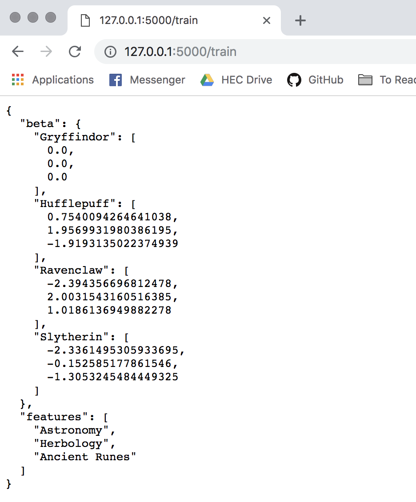
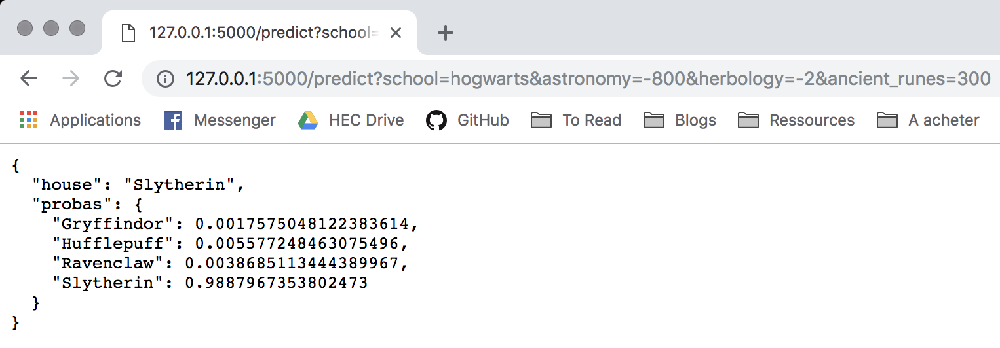
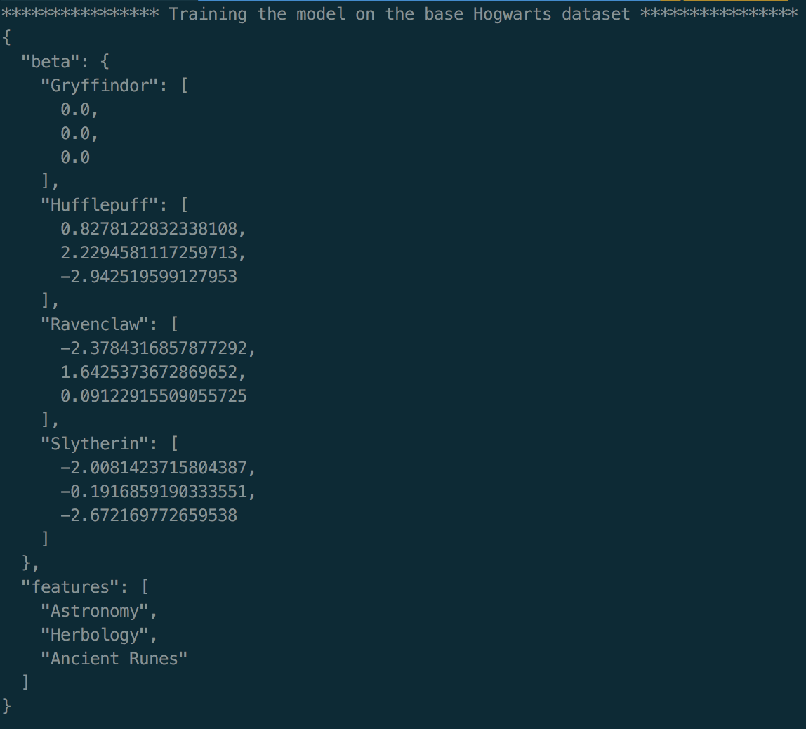
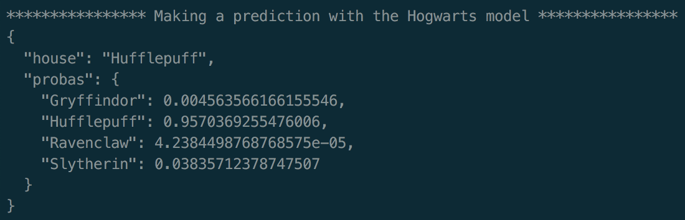
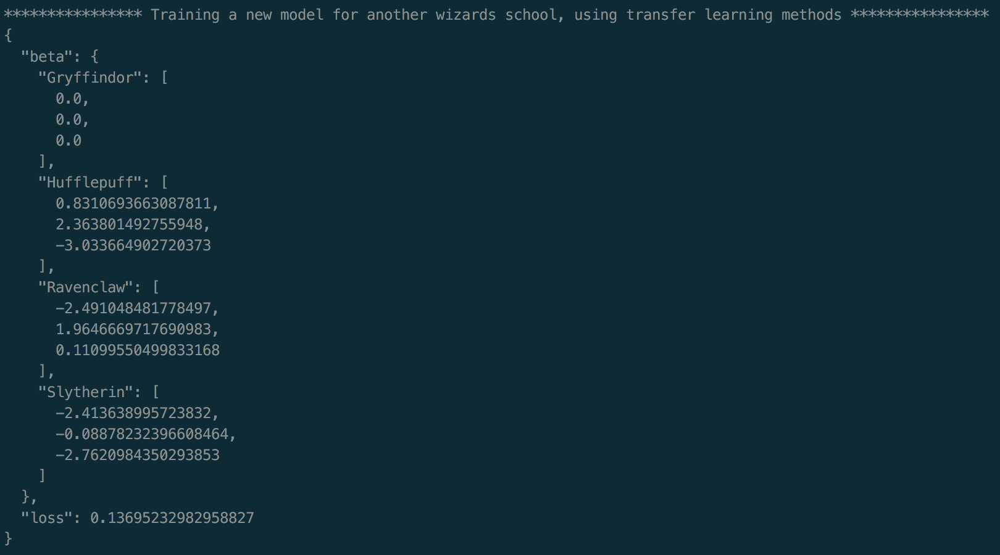
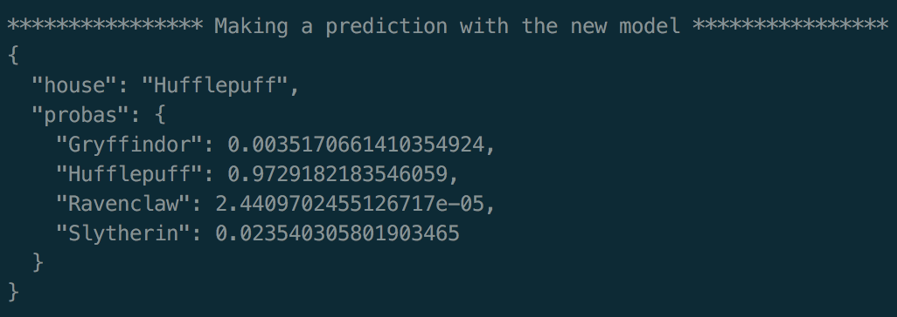

# Disrupt Hogwarts - API

### Project description
From the [Disrupt Hogwarts project](https://github.com/SachaIZADI/DisruptHogwarts) (which consisted in developing from scratch a python library for logistic regression), I built a Flask API.

The API offers three functionalities:

1. train: to train the model based on the initial data provided by 42.
2. transfer: to train a new model for another school using "transfer learning". What it actually does, is initializing a new model with the one previously trained on the Hogwarts dataset, and updates the model to fit the data of the new school with a smaller learning rate. Transfer learning can help algorithms learn much quicker. 
2. predict: to make a prediction, i.e. compute P(y=house|X=x_i) for a given school.


### Clone the repo
Run git clone `https://github.com/SachaIZADI/DisruptHogwarts_API.git` in your shell.

Then ```mkvirtualenv --python=`which python3` hogwarts_api``` (You can escape the virtualenv by running `deactivate)

Then finally run `pip3 install requirements.txt. And You're up to play with the project.

### How to use it

#### Locally

Launch the local server, by running


    python3 app.py

Output:



Server is now accessible on `http://127.0.0.1:5000`

The API can be run directly in the browser:

 

Or by using scripts such as [`test_api.py`](https://github.com/SachaIZADI/DisruptHogwarts_API/blob/master/test_and_debug/test_api.py):

   

#### On the cloud

TBC


